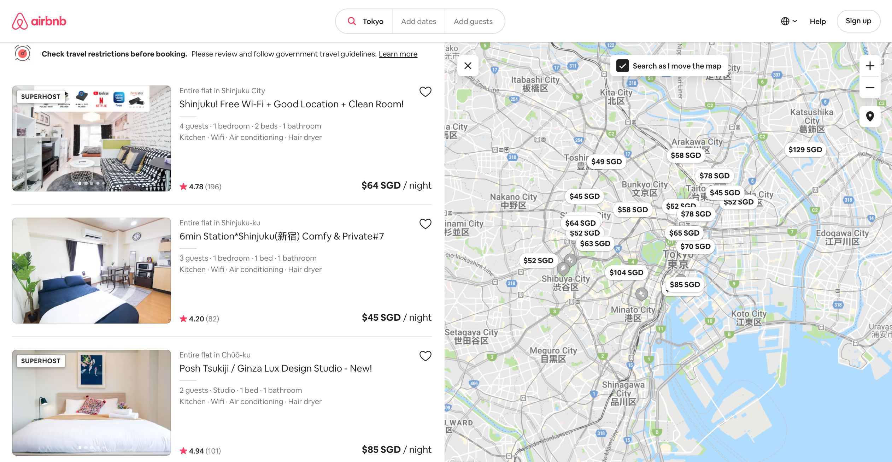

# Predicting the Best airbnb Listing Price 

_Author: Evonne Tham_

---

### Introduction

Airbnb is a online marketplace company that offers arrangement for lodging, homestays, or tourism experiences. It has become the world’s largest marketplaces with many travelers from all around the world, using it for the unique and authentic experience. As of 2020, Airbnb has over 7 million listings across the world, all powered by local hosts.

By sharing with travelers, this provides opportunity for homeowners to make more income from their homes. However with the constant increase of listings prices, hosts or even property managers are now face with a lot more competitors. Hence, getting the right listing price is crucial. If listing price is set too low, you will be missing out on a lot of potential income, and if listing price is set a tad bit higher you might lose a booking to other competitors. 

 
 

_Image Source: Airbnb Site_

 
 

Although there are third party pricing tools that are available to help price these properties, these tools can get quite pricey especially for people who are just starting out.

In order to solve this problem, I will be looking into the data from Toyko, one of the top most popular cities for Airbnb booking experiences. I will build a regression model to predict the best price of the listing in Toyko with respect to featurees such as the property or room type, location, etc. Model performance will be guided by R-Square and RMSE, and the model should at least improve upon baseline by 10%. Baseline is defined as the mean of the listing price.

___Citation:___
- https://news.airbnb.com/about-us/
- https://news.airbnb.com/fast-facts/
- https://ipropertymanagement.com/research/airbnb-statistics

---
### Content
- [Initial Exploratory Data Analysis and Cleaning](./codes/01_Data_Cleaning_and_EDA.ipynb)
- [Full Exploratory Data Analysis](./codes/02_Full_EDA.ipynb)
- [Feature Engineering and Model Benchmarks](./codes/03_Feature_Engineering_and_Model_Benchmarks.ipynb)
- [Model Tuning](./codes/04_Model_Tuning.ipynb)
- [Production Model](./codes/05_Production_Model.ipynb)

---
### Risks & Assumptions

- The data is not tempered and it accurate in producing a non-commercial derivation to allow public analysis, discussion and community benefit. 
- Some reviews may be "spam" allowed by Airbnb. Analysis suggests that spam reviews are small and do not affect the statistics.
- The Airbnb calendar for a listing does not differentiate between a booked night vs an unavailable night, therefore these bookings have been counted as "unavailable". This serves to understate the Availability metric because popular listings will be "booked" rather than being "blacked out" by a host.

---
### Data Source

Source of data of airbnb in Tokyo, Kantō, Japan, can be found on the InsideAirbnb site, [here](http://insideairbnb.com/get-the-data.html). 
It is sourced from publicly from the Airbnb site.

Within the country dataset some of the variables are: 

- `calendar`: Provide detail about booking for the next year, containing 7 attributes:
    - `date` (datetime)
    - `available` (categorical)
    - `price` (continous)
    - `adjusted_price` (continous)
    - `minimum_nights` (discrete)
    - `maximum_nights` (discrete)
    
    
- `listing`: Detailed Tokyo listings data containing 106 attributes of each listing. Some of them used in analysis are:
    - `price` (continous)
    - `property_type`(categorical)
    - `room_type`(categorical)
    - `neighbourhood_cleansed`(categorical)
    - `amenities`()
    - `review_scores`(discrete)

- `reviews`: Detailed reviews given by guests, containing 6 attributes
    - `listing_id` (discrete)
    - `date` (datetime)
    - `comment`

- `neighbourhood`: Neighbourhood list for geo filter. Sourced from city or open source GIS files.
